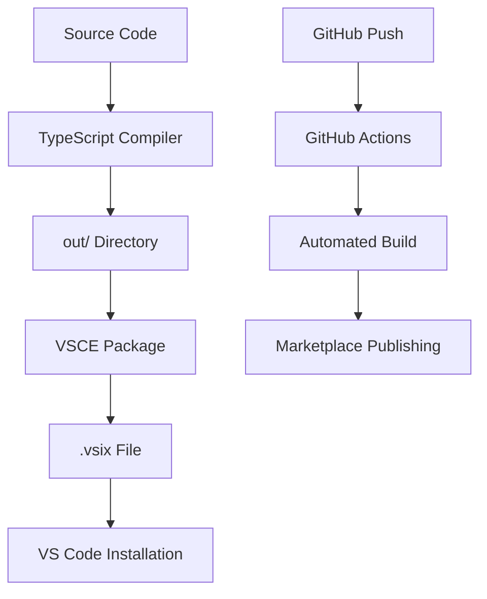

# 📁 Project Structure

This document outlines the complete folder structure and file organization for the MCP JSON Manager VS Code extension.

## 🗂️ Root Directory Structure

```
mcp-json-manager/
├── 📁 .github/                    # GitHub configuration
│   └── 📁 workflows/              # GitHub Actions workflows
│       ├── ci-cd.yml              # Main CI/CD pipeline
│       └── automated-release.yml  # Automated release workflow
├── 📁 .vscode/                    # VS Code workspace configuration
│   ├── launch.json               # Debug configuration
│   ├── tasks.json                # Build tasks
│   └── settings.json             # Workspace settings
├── 📁 src/                        # TypeScript source code
│   ├── extension.ts              # Main extension entry point
│   └── 📁 test/                   # Test files (optional)
│       ├── runTest.ts            # Test runner
│       └── 📁 suite/             # Test suites
│           ├── index.ts          # Test suite index
│           └── extension.test.ts # Extension tests
├── 📁 out/                        # Compiled JavaScript (auto-generated)
│   ├── extension.js              # Compiled main file
│   ├── extension.js.map          # Source maps
│   └── 📁 test/                   # Compiled tests
├── 📁 docs/                       # Documentation
│   ├── INSTALLATION.md           # Manual installation guide
│   ├── PUBLISHING.md             # Marketplace publishing guide
│   ├── RELEASE_SCRIPT.md         # Release script documentation
│   └── PROJECT_STRUCTURE.md     # This file
├── 📁 examples/                   # Example configurations
│   ├── example-mcp-config.json  # Sample MCP configuration
│   └── templates/                # MCP server templates
├── package.json                   # Extension manifest & dependencies
├── tsconfig.json                 # TypeScript configuration
├── .eslintrc.json                # ESLint configuration (optional)
├── .gitignore                    # Git ignore rules
├── .vscodeignore                 # VS Code packaging ignore rules
├── release.sh                    # Local release automation script
├── README.md                     # Main project documentation
├── CHANGELOG.md                  # Version history
├── LICENSE                       # MIT license
└── icon.png                      # Extension icon (128x128)
```

## 📋 File Descriptions

### 🔧 Core Configuration Files

#### `package.json` - Extension Manifest
```json
{
  "name": "mcp-json-manager",
  "displayName": "MCP JSON Manager", 
  "description": "Visual form-based manager for MCP configurations",
  "version": "0.0.1",
  "publisher": "your-publisher-id",
  "engines": { "vscode": "^1.74.0" },
  "categories": ["Other"],
  "main": "./out/extension.js",
  "contributes": { /* VS Code contributions */ },
  "scripts": { /* Build and package scripts */ },
  "devDependencies": { /* Development dependencies */ }
}
```

**Purpose**: Defines extension metadata, dependencies, VS Code contributions (commands, menus, views), and build scripts.

#### `tsconfig.json` - TypeScript Configuration
```json
{
  "compilerOptions": {
    "module": "commonjs",
    "target": "ES2020",
    "outDir": "out",
    "lib": ["ES2020"],
    "sourceMap": true,
    "strict": true
  },
  "files": ["src/extension.ts"],
  "exclude": ["node_modules", ".vscode-test", "out"]
}
```

**Purpose**: Configures TypeScript compilation settings, output directory, and included/excluded files.

#### `.gitignore` - Git Ignore Rules
```
node_modules/
out/
*.vsix
.vscode-test/
.DS_Store
npm-debug.log*
```

**Purpose**: Excludes files and directories from Git version control.

#### `.vscodeignore` - Packaging Ignore Rules
```
.vscode/**
.vscode-test/**
src/**
.gitignore
.eslintrc.json
tsconfig.json
**/*.map
```

**Purpose**: Excludes files from the final `.vsix` package to reduce size.

### 💻 Source Code Files

#### `src/extension.ts` - Main Extension File
```typescript
import * as vscode from 'vscode';

export function activate(context: vscode.ExtensionContext) {
    // Extension activation logic
    // Command registrations
    // Webview providers
    // Tree data providers
}

export function deactivate() {
    // Cleanup logic
}
```

**Purpose**: Main extension entry point containing activation/deactivation logic and core functionality.

**Key Components**:
- Command registration (`mcpManager.openManager`)
- Webview creation and management
- File system operations
- Tree view data provider
- Message handling between webview and extension

### 🤖 GitHub Actions Files

#### `.github/workflows/ci-cd.yml` - Main Pipeline
```yaml
name: CI/CD Pipeline
on: [push, pull_request, release]
jobs:
  test: # Build and test
  publish: # Marketplace publishing
```

**Purpose**: Continuous integration and deployment pipeline for testing and publishing.

#### `.github/workflows/automated-release.yml` - Release Automation
```yaml
name: Automated Release
on: 
  workflow_dispatch: # Manual trigger
  push: { tags: ['v*'] } # Tag-based trigger
jobs:
  automated-release: # Version management and release creation
```

**Purpose**: Automated release process with version bumping and changelog generation.

### 🧪 Development Tools

#### `.vscode/launch.json` - Debug Configuration
```json
{
  "version": "0.2.0",
  "configurations": [
    {
      "name": "Run Extension",
      "type": "extensionHost",
      "request": "launch",
      "args": ["--extensionDevelopmentPath=${workspaceFolder}"]
    }
  ]
}
```

**Purpose**: VS Code debugging configuration for testing the extension.

#### `.vscode/tasks.json` - Build Tasks
```json
{
  "version": "2.0.0",
  "tasks": [
    {
      "type": "npm",
      "script": "compile",
      "group": { "kind": "build", "isDefault": true }
    }
  ]
}
```

**Purpose**: Defines build tasks for compilation and development workflow.

#### `release.sh` - Local Release Script
```bash
#!/bin/bash
# Automated release script for local development
# Handles version bumping, tagging, and packaging
```

**Purpose**: Local release automation with interactive prompts and validation.

### 📚 Documentation Files

#### `README.md` - Main Documentation
- Extension overview and features
- Installation instructions  
- Usage examples
- Development setup
- Contributing guidelines

#### `CHANGELOG.md` - Version History
```markdown
# Changelog

## [0.0.1] - 2025-08-26
### Added
- Initial release
- Visual MCP configuration management
```

**Purpose**: Tracks version history and changes for users and developers.

#### `LICENSE` - MIT License
```
MIT License
Copyright (c) 2025 [Your Name]
...
```

**Purpose**: Legal license terms for the extension.

## 🎨 Asset Files

#### `icon.png` - Extension Icon
- **Size**: 128x128 pixels
- **Format**: PNG with transparency
- **Purpose**: Displayed in VS Code marketplace and extensions view

## 📦 Generated Files (Auto-created)

### `out/` Directory
- **`extension.js`**: Compiled TypeScript code
- **`*.js.map`**: Source maps for debugging
- **Contents mirror** `src/` structure

### `node_modules/` Directory
- **Dependencies**: Installed npm packages
- **Size**: Can be large (100MB+)
- **Excluded**: From Git and packaging

### `*.vsix` Files
- **Extension packages**: Created by `vsce package`
- **Examples**: `mcp-json-manager-0.0.1.vsix`
- **Purpose**: Installable extension files

## 🔍 File Size Analysis

### Small Files (<10KB)
- Configuration files (JSON, YAML)
- Documentation (Markdown)
- Script files

### Medium Files (10KB-100KB)  
- Source code files
- Compiled JavaScript
- README with examples

### Large Files (>100KB)
- Extension icon (if high-res)
- Example configurations
- Compiled bundles

## 📁 Optional Directories

### `examples/` - Sample Configurations
```
examples/
├── basic-mcp-config.json         # Simple example
├── advanced-mcp-config.json      # Complex example
└── templates/                    # Server templates
    ├── filesystem-server.json
    ├── web-search-server.json
    └── database-server.json
```

### `scripts/` - Utility Scripts
```
scripts/
├── setup.sh                     # Development setup
├── test.sh                      # Testing utilities
└── deploy.sh                    # Deployment helpers
```

### `assets/` - Additional Assets
```
assets/
├── screenshots/                 # UI screenshots
├── diagrams/                    # Architecture diagrams
└── logos/                       # Branding assets
```

## 🏗️ Build Process Flow



## 🔄 Development Workflow

### 1. **Setup Phase**
```bash
git clone repo
npm install
code .
```

### 2. **Development Phase**
```bash
npm run watch      # Continuous compilation
F5                 # Launch extension host
```

### 3. **Testing Phase**
```bash
npm run compile
npm run package
code --install-extension *.vsix
```

### 4. **Release Phase**
```bash
./release.sh minor
# Or use GitHub Actions
```

## 📊 File Dependencies

### Core Dependencies
- **package.json** → All other files
- **tsconfig.json** → TypeScript files
- **src/extension.ts** → Main functionality

### Build Dependencies
- **Source files** → Compiled output
- **Configuration** → Build process
- **Scripts** → Automation

### Runtime Dependencies
- **Compiled JS** → VS Code execution
- **Package.json** → Extension registration
- **Assets** → User interface

## 🚀 Getting Started

### 1. **Clone Repository**
```bash
git clone https://github.com/your-username/mcp-json-manager.git
cd mcp-json-manager
```

### 2. **Install Dependencies**
```bash
npm install
```

### 3. **Build Extension**
```bash
npm run compile
```

### 4. **Test Locally**
```bash
F5 # In VS Code, opens Extension Development Host
```

### 5. **Package for Distribution**
```bash
npm run package
```

## 🔧 Customization Points

### Adding New Features
- **Commands**: Update `package.json` contributes
- **UI**: Modify webview HTML in `extension.ts`
- **Logic**: Add TypeScript code in `src/`

### Build Configuration
- **TypeScript**: Modify `tsconfig.json`
- **Packaging**: Update `.vscodeignore`
- **CI/CD**: Edit `.github/workflows/`

### Documentation
- **User Guide**: Update `README.md`
- **API Docs**: Add to `docs/` directory
- **Examples**: Create in `examples/`

---

**💡 Pro Tip**: Use VS Code's built-in file explorer and search functionality to navigate this structure efficiently. The consistent naming and organization makes it easy to find specific files!